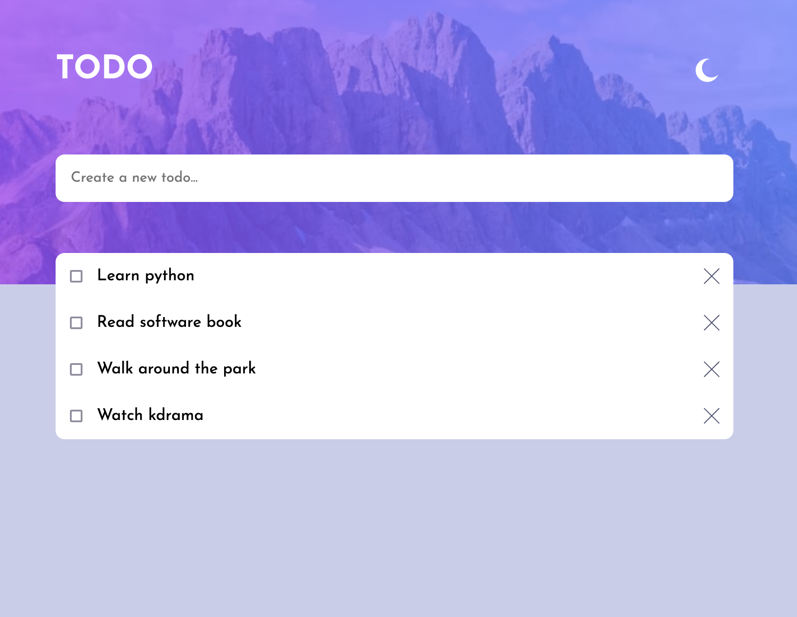
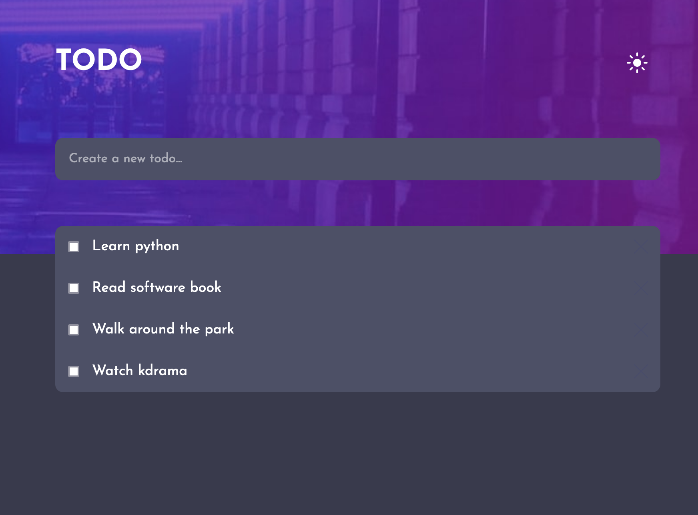

# Frontend Mentor - Todo app solution

This is a solution to the [Todo app challenge on Frontend Mentor](https://www.frontendmentor.io/challenges/todo-app-Su1_KokOW). Frontend Mentor challenges help you improve your coding skills by building realistic projects. 

The solution is available in [Todo app with Alpine Js](https://caceresgianinna.github.io/alpine-js-tutorial/)

## Table of contents

- [Overview](#overview)
  - [The challenge](#the-challenge)
  - [Screenshot](#screenshot)
  - [Links](#links)
- [My process](#my-process)
  - [Built with](#built-with)
  - [What I learned](#what-i-learned)
  - [Continued development](#continued-development)
  - [Useful resources](#useful-resources)
- [Author](#author)
- [Acknowledgments](#acknowledgments)

**Note: Delete this note and update the table of contents based on what sections you keep.**

## Overview

### The challenge

Users should be able to:

[x] View the optimal layout for the app depending on their device's screen size
[x] See hover states for all interactive elements on the page
[x] Add new todos to the list
[x] Mark todos as complete
[x] Delete todos from the list
[] Filter by all/active/complete todos
[] Clear all completed todos
[] Toggle light and dark mode
[] **Bonus**: Drag and drop to reorder items on the list

### Screenshot

### Links

- Solution URL: [Todo app with Alpine Js](https://caceresgianinna.github.io/alpine-js-tutorial/)

## My process

### Built with

- Semantic HTML5 markup
- Web Accessibility
- CSS custom properties
- Flexbox
- Mobile-first workflow
- [Alpine Js](https://alpinejs.dev/) - Js library

### What I learned

- Creating a theme using CSS custom properties
- Refreshing CSS and HTML concepts
- Creating accessible checkboxes
- Creating Alpine Js components

### Continued development

Areas of improvement:

- Use a grid system
- Break down Alpine componets into their own files
- Create an Alpine component for the to-do item
- Add Jest unit tests
- Complete the challenge (drag and drop, other features)

## Author
 - Gianinna Caceres
